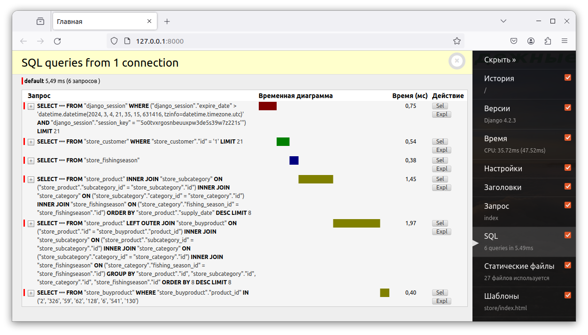
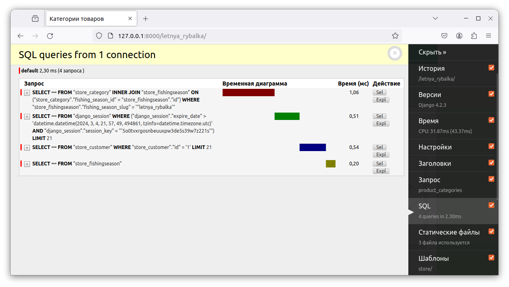
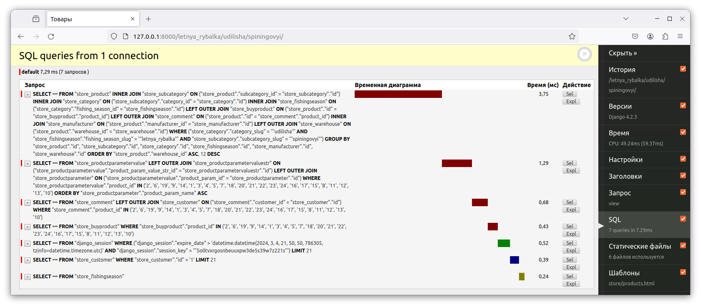
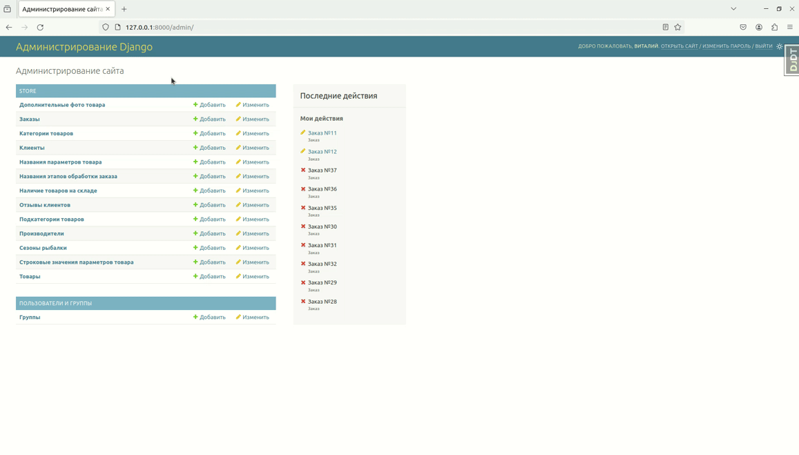

# Сайт рыболовного интернет-магазина

### Краткое описание проекта
Данный проект представляет собой сайт интернет-магазина рыболовных товаров.
Все товары магазина распределены по сезонам рыбалки, категориям и подкатегориям. Для поиска товаров по необходимым 
параметрам предусмотрены фильтры. На сайте для пользователей имеются возможности прохождения процедур регистрации 
и авторизации, после прохождения которых можно получить доступ к личному кабинету, оформлять заказы и многое другое 
(см. ниже).

### Описание технической стороны проекта
Проект является тренировочным, главной целью проекта была отработка навыков работы с фреймворком Django 
в связке с СУБД PostrgreSQL по части бэкенда, а также использование JavaScript для отображения динамики 
на стороне клиента.
Разработана база данных сайта с использованием модели данных (архитектуры) EAV. 
Оптимизированы sql запросы в ORM, для каждой страницы сайта вышло суммарно не более 7 sql запросов.
Cделана корзина товаров с использованием сессий Django. Создан слайдер на главной странице, фильтры для поиска товаров по заданным параметрам.


#### *Демонстрация характеристик sql запросов к БД для некоторых страниц сайта*
<p style="display:flex;">
  
  
</p>




### Возможности и функционал сайта касательно пользователя (покупателя)
- Любой пользователь сайта может просматривать товары, добавлять их в корзину, из которой можно удалять выбранные 
товары, а также изменять их количество.
- Оформлять заказы могут только авторизированные пользователи
- Авторизированный пользователь сайта имеет доступ к своему личному кабинету, где может редактировать личные данные и 
данные для доставки, смотреть сведения об оформленных заказах, а также отслеживать треки доставок и статусы заказов
- Авторизированный пользователь сайта может писать отзывы и ставить оценки к товарам


### Возможности и функционал сайта касательно администратора
- создание товаров с описанием, параметрами, ценами, основным и дополнительными фото ;
- управление статусами заказов

### Демонстрация работы сайта
#### *Главная и страница с подробностями о популярном товаре*
<p align="center">
  
</p>

#### *Обзор товаров, использование фильтров*
<p align="center">
  
</p>

#### *Покупка товаров, личный кабинет и оформленные заказы*
<p align="center">

</p>

#### *Административная панель, просмотр назначенных параметров товара*
<p align="center">

</p>

### Для запуска проекта локально необходимо выполнить следующие действия:
1. Установить зависимости проекта
   ``` commandline
   pip install -r requirements.txt
   ```
2. Переименовать файл .env_example в .env
3. Перейти в папку проекта
   ``` commandline 
   cd FishingShop
   ```
   
4. Запустить консоль Django, импортировать utils, сгенирировать SECRET_KEY
   ``` commandline
   python manage.py shell
   ```
   ``` commandline
   from django.core.management import utils
   ```
   ``` commandline
   utils.get_random_secret_key()
   ```  
   
5. Заполнить файл .env
6. Создать и применить миграции
   ``` commandline
   python manage.py makemigrations 
   ```
   ``` commandline
   python manage.py migrate
   ``` 

7. Создать суперпользователя для управления админ-панелью
   ``` commandline
   python manage.py createsuperuser
   ```
   
8. Добавить тестовые данные в БД (можно добавить через админ-панель)
9. При желании добавить статические изображения (папка FishingShop/store/static/img), 
   не забыв указать к ним пути в html файлах.
10. Запустить локальный сервер разработки Django
    ``` commandline
    python manage.py runserver
    ```
11. Перейти по ссылке: http://127.0.0.1:8000

